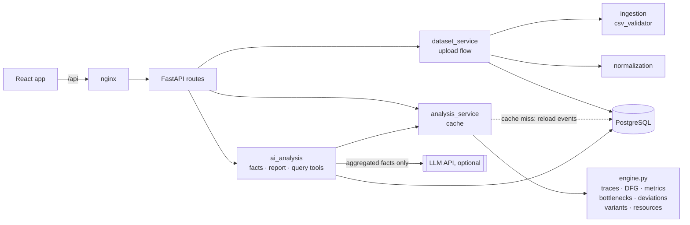
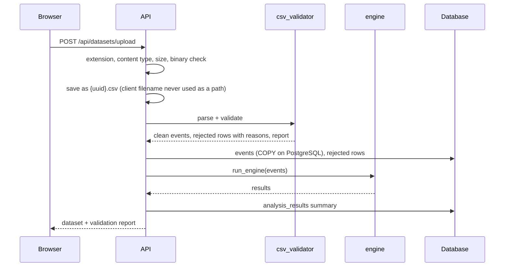
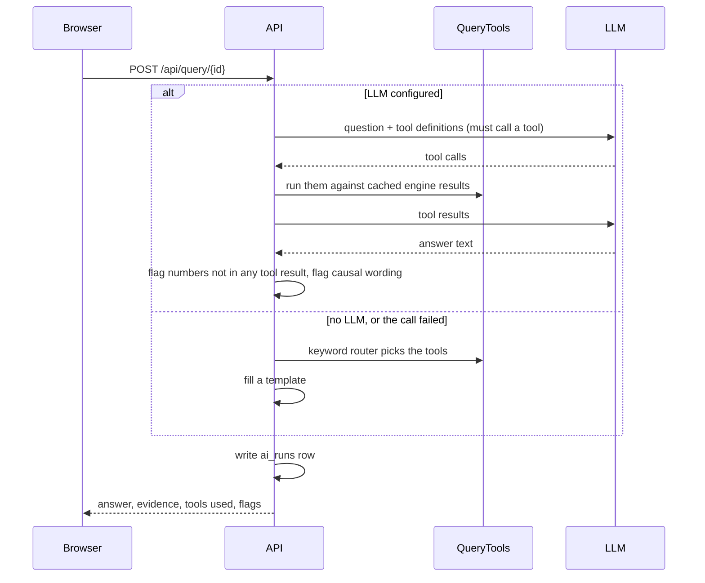

# Architecture

The README covers what the engine calculates. This page is about how the pieces fit
together and why they're built the way they are.

## Components

In local development Vite's dev server takes nginx's place.

## Upload

## A chat question

## Decisions

**The engine doesn't know the LLM exists.** `services/engine.py` and everything it
calls import nothing from `ai_analysis`. That keeps every number testable without
mocking a model, and it's why the app is fully usable with `LLM_PROVIDER=none`.

**The LLM gets facts, not events.** Sending 100k rows would be slow and expensive,
and it would invite the model to compute its own numbers. Instead `context.py` builds
a bounded fact sheet (roughly 150 entries) with stable ids. Findings cite ids and the
server fills in the values. A test checks that no case id reaches the prompt.

**Flag rather than block.** The causal-language and unverified-number checks are
word lists and regexes; they'll miss things and occasionally trip on harmless text.
So they add visible flags instead of silently rejecting answers. The structural
safeguards (fact ids, tool-only numbers, schema validation) are the real protection.

**Work per variant, not per case.** The LCS alignment in `deviations.py` runs once
per distinct sequence and is copied to cases. The sample has 10,000 cases and 179
variants. Everything else is groupby/shift on sorted data, so the whole engine is
O(N log N) and runs in about 1.5 s on the 110k-event sample.

**Synchronous uploads, in-process cache.** No queue, no Redis. The upload request
runs the engine once, and results stay in a small LRU (`analysis_service.py`). The
catch is that the cache is per process, so the backend runs one uvicorn worker. If
that becomes a limit, the next step is storing the computed frames in PostgreSQL, not
adding infrastructure.

**PostgreSQL, but portable.** Models use types that also work on SQLite (JSON becomes
JSONB on PostgreSQL). Tests run on in-memory SQLite, and the app runs on a SQLite file
for a quick local try. Events are loaded with `COPY` on PostgreSQL because row inserts
were the slowest part of an upload.

**No vector store.** Questions are about computed metrics, which the query tools
answer exactly. Semantic search over something wouldn't add anything here.

**Every threshold is configuration.** Bottleneck weights, score thresholds, the IQR
multiplier, minimum support, and the completion rule live in `AnalysisConfig`.
Results are cached per config hash, and the API echoes the values it used.

## Where future work plugs in

| Capability | Where |
|---|---|
| Segment / root-cause comparisons | New `QueryTools` methods over `EngineResult.ev`, which already carries amount, priority and other attributes |
| Conformance against an imported BPMN model | Alongside `deviations.py`, with the dominant path kept as the default reference |
| Remaining-time or next-activity prediction | A new service reading `EngineResult.ev` and `traces` |
| Other sources (ERP exports, streaming) | New ingestion adapters producing the same normalized event frame |
| Several backend workers | Persist `EngineResult` frames instead of keeping them in the process |
